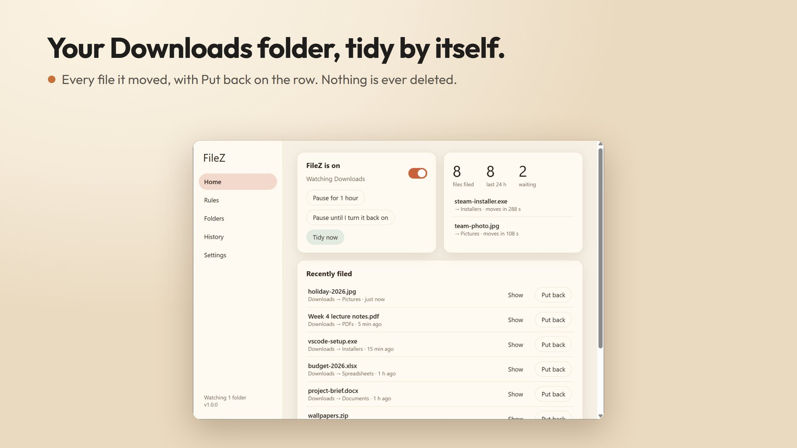
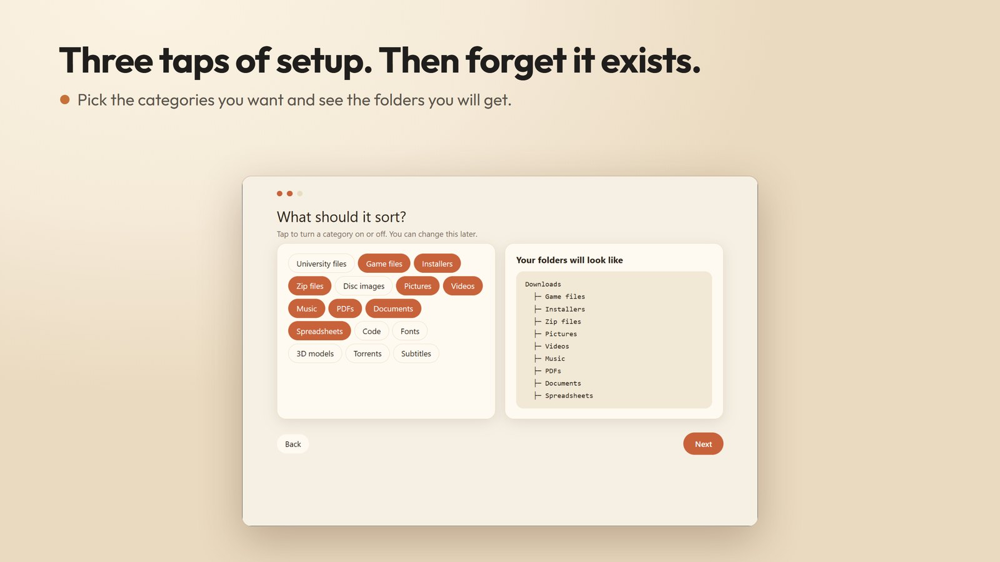
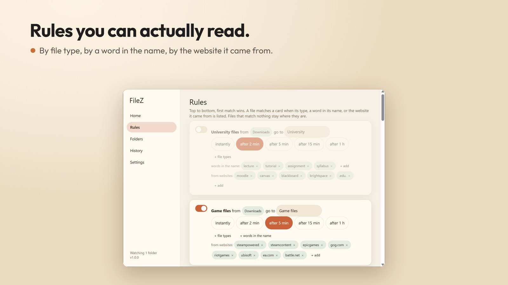
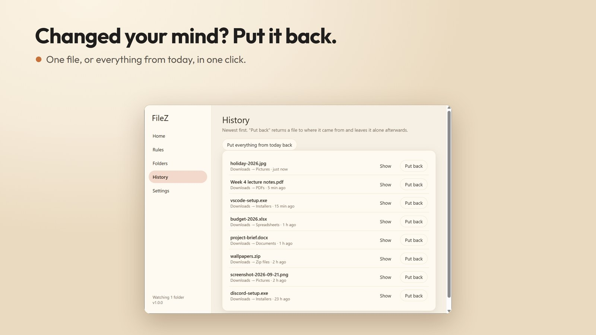
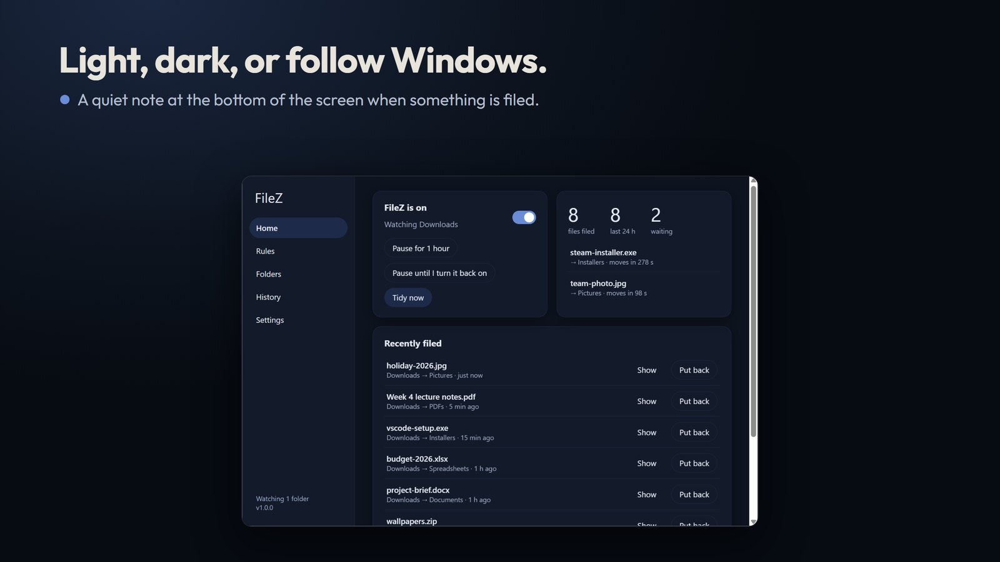
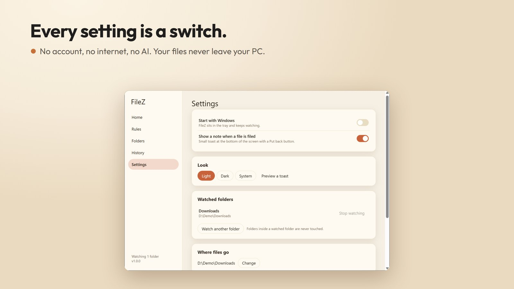

# FileZ

*Source-visible, proprietary — see [LICENSE](LICENSE).*

**Your Downloads folder, tidy by itself. Nothing is ever deleted, and every move has a
Put back button.**

FileZ is a small Windows app that watches the folders you choose (Downloads by default)
and quietly moves new files into folders you can read at a glance: Installers, Zip files,
Pictures, Videos, Music, PDFs, Documents, Spreadsheets, Game files, 3D models, and any rule
you add yourself.

No AI, no account, no internet. Rules only: a file's type, a word in its name, or the
website it was downloaded from. Every decision in the app is a switch or a pill.

Windows 10/11, x64. Built with Rust and Tauri v2. No analytics, no ads, no network code.

---

## Screenshots













---

## What it does

- **Set it once, forget it.** A three-step setup: which folders, which categories, where the
  folders go. Then it sits in the tray.
- **Waits for downloads to finish.** Pictures and documents move two minutes after they stop
  changing, installers and zips after five, so a file you are about to open does not vanish
  under you. Half-downloaded files are never touched.
- **Knows where a download came from.** "Files from moodle go to University" works with
  zero guessing, because Windows records the source of every browser download.
- **Put back.** Every move is in the History with a Put back button, plus "Put everything
  from today back". A file you put back is left alone afterwards.
- **Only new files, if you want.** On first run it tells you how many existing files match,
  and lets you leave them alone.
- **Rules you can edit.** Add file types, name words or websites to any card, change where it
  goes and how long it waits, or add your own rule.
- **Tidy folders.** A category folder that stays empty for a week is removed (optional).
- **Light, dark, or follow Windows.** A small toast at the bottom of the screen when
  something is filed, with Put back right on it.

## Install

**Microsoft Store (recommended):** [Get FileZ](https://apps.microsoft.com/detail/9MVK3ST0Z29J).
Signed by the Store, updates come by themselves, no publisher warning.

[](https://apps.microsoft.com/detail/9MVK3ST0Z29J?mode=direct)

**Without the Store:** download the latest **`FileZ_*_x64-setup.exe`** from
[Releases](../../releases) and run it. It installs into your own user folder and never asks
for an admin password. Windows will warn that the publisher is unknown, because that build is
not code-signed: choose **More info → Run anyway**.

## Privacy and security

FileZ has no network code and cannot send anything anywhere. What it reads and writes is
spelled out in [PRIVACY.md](PRIVACY.md). To report a vulnerability, see
[SECURITY.md](SECURITY.md).

## Building it yourself

```bash
npm install
npm run tauri build      # installer in src-tauri/target/release/bundle/nsis
npm run msix             # Store package (needs the Windows SDK and msix/identity.json)
```

Rust (stable), Node 20+, and the Microsoft Visual C++ build tools are required.

## Licence

Source-available, not open source: you can read, build and run it for yourself; you cannot
redistribute builds or publish a derivative. See [LICENSE](LICENSE) and
[THIRD-PARTY-NOTICES.md](THIRD-PARTY-NOTICES.md).
